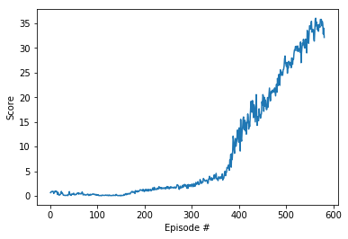

# Report

THe implementation here is similar to the MADDPG algorithm, which is a multi-agent extension for DDPG [1]. The impleentation here start with the Udacity DDPG-bipedal notebook and extended that algorithm for multiple agents [2]. Here, we show the algorithm running for twenty agents.

## Learning algorithm

The learning algorithm is based on Deep Deterministic Policy Gradients (DDPG) which learns the Q functions, and in turn uses the Q-function to learn the policy. DDPG can be described as an extension of DQN for continuous action spaces. It is similar to actor-critic methods in that it makes use of two deep neural networks. The "actor" learns to maximize the action-values function Q, while the "critic" learns to evaluate the action-value estimates from the "actor". 

This algorithm also feature soft updates, containing two copies of each of the neural networks described above, known as local and target versions. The target networks are updated by a reduced factor from the updated local networks, e.g. 0.01% local + 99.99% target. In this way, the target network slowly incorporates updates from the local networks while maintaining stability. The target networks are then used to make predictions. More details on this can be found at [3]. The hyperparameters we used are listed below:

* Replay buffer size: 1e5
* Minibatch size: 128   
* Discount factor: 0.99            
* Tau (for update of target parameters): 1e-3             
* Actor learning rate: 1.5e-4        
* Critic learning rate: 1.5e-4       
* L2 weight decay: 0.0   
* Number of agents: 20
* Maximum number of timesteps per episode: 1e5

### Model Architectures:

#### Actor 

Actor(\
&nbsp;&nbsp;&nbsp;&nbsp;&nbsp;&nbsp;  (fc1): Linear(in_features=33, out_features=256, bias=True)\
&nbsp;&nbsp;&nbsp;&nbsp;&nbsp;&nbsp;  (fc2): Linear(in_features=256, out_features=128, bias=True)\
&nbsp;&nbsp;&nbsp;&nbsp;&nbsp;&nbsp;  (fc3): Linear(in_features=128, out_features=4, bias=True)\
)

#### Critic

Critic(\
&nbsp;&nbsp;&nbsp;&nbsp;&nbsp;&nbsp;  (fcs1): Linear(in_features=33, out_features=256, bias=True)\
&nbsp;&nbsp;&nbsp;&nbsp;&nbsp;&nbsp;  (fc2): Linear(in_features=260, out_features=128, bias=True)\
&nbsp;&nbsp;&nbsp;&nbsp;&nbsp;&nbsp;  (fc3): Linear(in_features=128, out_features=1, bias=True)\
)

## Results

The environment was solved in 581 episodes.

## Ideas for Future Work

* Hyperparamter tuning: Convergence was relatively slow, so I would like to do additional hyperparameter tuning to speed that up.
* Try other multi agent algorithms: I would like to try PPO, TRPO, Rainbow & A3C to compare performance.
* Architecture modifications: I would like to see how modifications to both the control flow (e.g. how many times we update during a step) and neural network architectures to compare performance.

## References
1. https://arxiv.org/pdf/1706.02275.pdf
2. https://github.com/udacity/deep-reinforcement-learning/tree/master/ddpg-bipedal
3. https://spinningup.openai.com/en/latest/algorithms/ddpg.html
